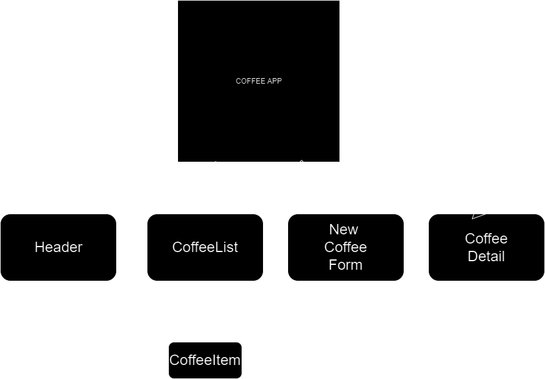

# Local Biz For Coffee Shop Inventory Tracker

## Project Overview
This application is a Coffee Shop Inventory Tracker built using React. It helps track the inventory of different types of coffee beans. Users can view a list of available coffee beans, add new types to the inventory, and manage the quantities as they are sold or given away.

## Installation and Setup
To run this project locally:
1. Clone the repository: `git clone [Your-Repository-URL]`
2. Navigate to the project directory: `cd coffee-inventory-tracker`
3. Install dependencies: `npm install`
4. Start the application: `npm start`
5. Open `http://localhost:3000` to view it in your browser.

## Usage
- **View Coffee List:** The home page displays a list of all available coffee beans with details like name, origin, price, and roast.
- **Add New Coffee:** Fill out the form to add a new type of coffee bean to the inventory.
- **Manage Inventory:** Click on a coffee bean item to view details and decrement the inventory as sales are made.

## Technology Stack
- React
- CSS
- JavaScript

## Component Diagram

1. App Component: The root of the application, responsible for maintaining the overall state of the coffee inventory and orchestrating the interaction between child components.

2. Header Component: A simple presentational component that displays the title of the application, enhancing the visual structure and user experience.

3. CoffeeList Component: This component renders a list of all coffee types available in the inventory. It acts as a container for individual CoffeeItem components, each representing a distinct type of coffee.

4. CoffeeItem Component: A child component of CoffeeList, CoffeeItem displays the details of a specific type of coffee, such as its name, origin, and roast level. It allows users to select a coffee item to view more details or perform actions like decrementing the inventory.

5. NewCoffeeForm Component: This component is responsible for adding new types of coffee to the inventory. It provides a form where users can input details about the coffee, like its name, origin, and price. Once submitted, the new coffee data is added to the overall inventory.

6. CoffeeDetail Component (optional): If implemented, this component would show detailed information about a specific coffee item when selected from the CoffeeList. It could include features like displaying the current stock level and providing an option to decrement the stock as sales are made.

## Contributing
Contributions are welcome! If you have suggestions or improvements, please feel free to fork the repository and submit a pull request.

## License
MIT License

Copyright (c) 2023 Similoluwa Oyinkolade

Permission is hereby granted, free of charge, to any person obtaining a copy of this software and associated documentation files (the "Software"), to deal in the Software without restriction, including without limitation the rights to use, copy, modify, merge, publish, distribute, sublicense, and/or sell copies of the Software, and to permit persons to whom the Software is furnished to do so, subject to the following conditions:

This project was bootstrapped with [Create React App](https://github.com/facebook/create-react-app).

# Getting Started with Create React App

This project was bootstrapped with [Create React App](https://github.com/facebook/create-react-app).

## Available Scripts

In the project directory, you can run:

### `npm start`

Runs the app in the development mode.\
Open [http://localhost:3000](http://localhost:3000) to view it in your browser.

The page will reload when you make changes.\
You may also see any lint errors in the console.

### `npm test`

Launches the test runner in the interactive watch mode.\
See the section about [running tests](https://facebook.github.io/create-react-app/docs/running-tests) for more information.

### `npm run build`

Builds the app for production to the `build` folder.\
It correctly bundles React in production mode and optimizes the build for the best performance.

The build is minified and the filenames include the hashes.\
Your app is ready to be deployed!

See the section about [deployment](https://facebook.github.io/create-react-app/docs/deployment) for more information.

### `npm run eject`

**Note: this is a one-way operation. Once you `eject`, you can't go back!**

If you aren't satisfied with the build tool and configuration choices, you can `eject` at any time. This command will remove the single build dependency from your project.

Instead, it will copy all the configuration files and the transitive dependencies (webpack, Babel, ESLint, etc) right into your project so you have full control over them. All of the commands except `eject` will still work, but they will point to the copied scripts so you can tweak them. At this point you're on your own.

You don't have to ever use `eject`. The curated feature set is suitable for small and middle deployments, and you shouldn't feel obligated to use this feature. However we understand that this tool wouldn't be useful if you couldn't customize it when you are ready for it.

## Learn More

You can learn more in the [Create React App documentation](https://facebook.github.io/create-react-app/docs/getting-started).

To learn React, check out the [React documentation](https://reactjs.org/).

### Code Splitting

This section has moved here: [https://facebook.github.io/create-react-app/docs/code-splitting](https://facebook.github.io/create-react-app/docs/code-splitting)

### Analyzing the Bundle Size

This section has moved here: [https://facebook.github.io/create-react-app/docs/analyzing-the-bundle-size](https://facebook.github.io/create-react-app/docs/analyzing-the-bundle-size)

### Making a Progressive Web App

This section has moved here: [https://facebook.github.io/create-react-app/docs/making-a-progressive-web-app](https://facebook.github.io/create-react-app/docs/making-a-progressive-web-app)

### Advanced Configuration

This section has moved here: [https://facebook.github.io/create-react-app/docs/advanced-configuration](https://facebook.github.io/create-react-app/docs/advanced-configuration)

### Deployment

This section has moved here: [https://facebook.github.io/create-react-app/docs/deployment](https://facebook.github.io/create-react-app/docs/deployment)

### `npm run build` fails to minify

This section has moved here: [https://facebook.github.io/create-react-app/docs/troubleshooting#npm-run-build-fails-to-minify](https://facebook.github.io/create-react-app/docs/troubleshooting#npm-run-build-fails-to-minify)
